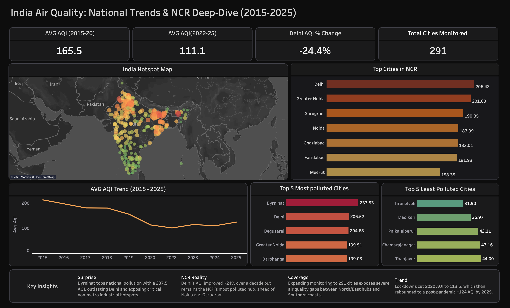
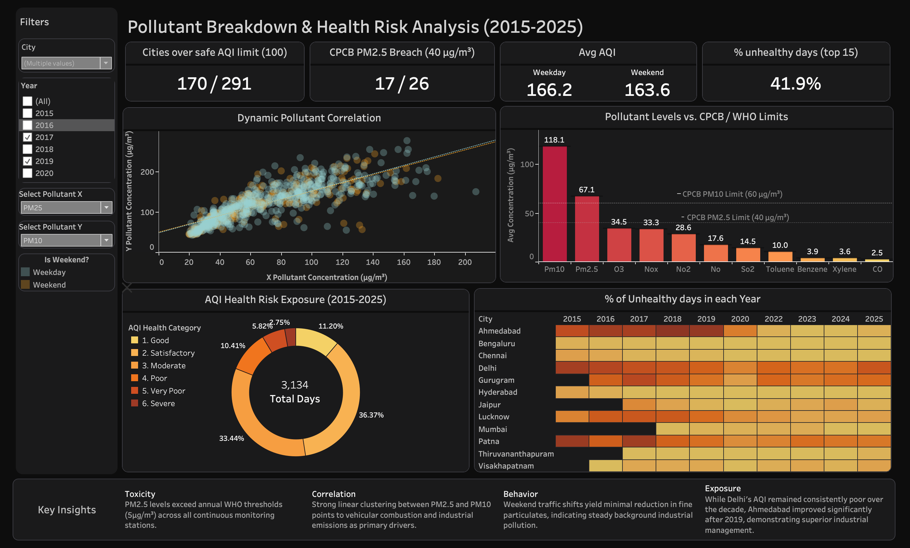

# 🌫️ India Air Quality Analysis (2015-25)


An end-to-end data analytics project analyzing **India's air quality trends from 2015 to 2025** across **291 cities**, with a focused deep-dive into NCR pollution patterns, pollutant levels, and health-risk exposure.

## 🚀 Project Overview

This project combines **SQL data cleaning**, **Python preprocessing**, **exploratory data analysis**, and **dashboard storytelling** to identify national AQI trends, pollution hotspots, CPCB/WHO limit breaches, and city-level air quality differences.

The dashboard focuses on:

- National AQI trends from 2015-2025
- NCR pollution hotspot analysis
- PM2.5 and PM10 pollutant exposure
- AQI health-risk categories
- City-wise pollution comparison

## 📊 Dashboard Preview





## 📌 Key Insights

- 📉 Average AQI dropped from **165.5** during 2015-2020 to **111.1** during 2022-2025.
- 🏙️ Delhi's AQI improved by around **24%**, but still remains one of NCR's most polluted hubs.
- ⚠️ **170 out of 291 cities** crossed safe AQI limits.
- 🔥 NCR cities including Delhi, Greater Noida, Gurugram, Noida, Ghaziabad, and Faridabad remain major pollution hotspots.
- 🧪 PM2.5 and PM10 continue to breach recommended safety limits.
- 📆 AQI dropped sharply around the 2020 lockdown period, followed by a post-pandemic rebound.

## 🛠️ Tools and Technologies

| Category | Tools |
| --- | --- |
| Programming & Analysis | Python, Pandas, NumPy, SciPy |
| Database | SQL, SQL Server |
| Connectivity | SQLAlchemy, PyMSSQL |
| Visualization | Matplotlib, Seaborn, Geospatial Mapping |
| Environment | Jupyter Notebook |
| Reporting | Dashboard Design, Data Storytelling |

## 📁 Repository Structure

```text
Air-Quality-Analysis/
|-- notebooks/
|   |-- city_coordinates_for_map.csv
|   |-- data_ingestion.ipynb
|   |-- eda_analysis.ipynb
|
|-- scripts/
|   |-- clean_data.py
|
|-- sqlCleaning/
|   |-- Cleaning.sql
|
|-- .gitignore
|-- README.md
```

## 🔄 Workflow

- **Data Cleaning:** Standardized columns, parsed dates, handled nulls, removed invalid pollutant values, and treated outliers.
- **SQL Validation:** Used T-SQL to check duplicates, AQI anomalies, PM2.5/PM10 inconsistencies, and create a unified AQI view.
- **EDA:** Explored city-wise AQI trends, pollutant distributions, correlations, and health-risk categories.
- **Dashboarding:** Built visual views for national trends, NCR hotspots, pollutant limits, and unhealthy-day exposure.

## 📌 Important Metrics

| Metric | Value |
| --- | ---: |
| Average AQI, 2015-2020 | 165.5 |
| Average AQI, 2022-2025 | 111.1 |
| Delhi AQI Change | -24.4% |
| Total Cities Monitored | 291 |
| Cities Over Safe AQI Limit | 170 / 291 |
| CPCB PM2.5 Breach | 17 / 26 |
| Unhealthy Days, Top 15 | 41.9% |

## ⚙️ How to Use This Repository

```bash
git clone https://github.com/PoorabAgrawal19/Air-Quality-Analysis.git
cd Air-Quality-Analysis
pip install pandas numpy sqlalchemy pymssql matplotlib seaborn scipy
python scripts/clean_data.py
```

Then open the notebooks in this order:

1. `notebooks/data_ingestion.ipynb`
2. `notebooks/eda_analysis.ipynb`

Use `sqlCleaning/Cleaning.sql` in SQL Server after importing the cleaned datasets into the database.

## ✅ Skills Demonstrated

- Data cleaning and preprocessing
- SQL data validation
- Exploratory data analysis
- Pollutant correlation analysis
- Geospatial analysis
- Dashboard design
- Data storytelling

## 👤 Author

**Poorab Agrawal**

GitHub: [PoorabAgrawal19](https://github.com/PoorabAgrawal19)
